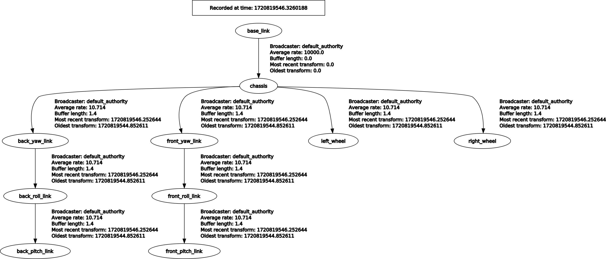

### box_bot_description

#### Notes
1. The wheels are rotated in the link, not the joint.
2. Each wheel is rotated around two axes to avoid the differential drive moving the robot opposite the sign of the linear velocity component.
3. Same with the caster-wheel cylindrical components.

#### Frames

`ros2 run rqt_tf_tree rqt_tf_tree`  

  

#### Rviz2

##### 1. Geometric
  

##### 2. Mesh
  

