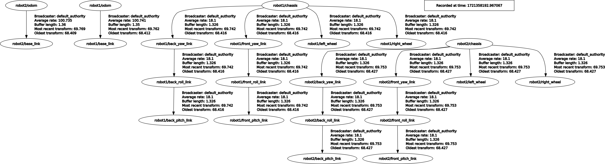

### `box_bot_description`

#### `box_bot_gazebo`

These repos go together. [`box_bot_gazebo`](https://github.com/ivogeorg/box_bot_gazebo) uses this package to populate the robot in Gazebo.

#### Notes
1. The wheels are rotated in the link, not the joint.
2. Each wheel is rotated around two axes to avoid the differential drive moving the robot opposite the sign of the linear velocity component.
3. Same with the caster-wheel cylindrical components.

#### Frames

`ros2 run rqt_tf_tree rqt_tf_tree`  

  

##### Final frames

  

#### Rviz2

##### Starting Rviz2 and `joint_state_publisher_gui`

1. Expected [`rviz/urdf_vis.rviz`](rviz/urdf_vis.rviz) config file.
2. In a terminal:
   1. `cd ~/ros2_ws`
   2. `colcon build --packages-select box_bot_description`
   3. `source install/setup.bash`
   4. `ros2 launch box_bot_description urdf_visualize_geometric.launch.py`
3. In another terminal:
   1. `cd ~/ros2_ws`
   2. `source install/setup.bash`
   3. `ros2 launch joint_state_publisher_gui joint_state_publisher_gui`

##### 1. Geometric
  

##### 2. Mesh
  

#### Laser sensor link and joint tree

| Rviz2 | `rqt_tf_tree` |
| --- | --- |
|  |  |

1. The laser sensor link-and-joint subtree branches off the `chassis` link with a _prismatic_ joint, which moves up and down the z-axis and holds the rest of the subtree.
2. The `laser_scan_link` is a parent of two joints:
   1. The _fixed_ joint connects the `laser_scan_frame` link to it, and is used to attach the ROS ray sensor plugin, which implements the laser sensor simulation and visualization. Being attached so, the laser scanner can be moved up and down as well.  
   2. The _continuous_ joint connects the laser sensor housing to it (rather generically named `laser_scan_model_link`), and it can rotate around the z-axis at a given velocity.
   3. **Note:** There is no connection between the rotation of the housing and that of the rays of the plugin. These are completely separate simulations.

#### Spawning multiple robots of the same model

1. Need to use namespaces for the TF frames and topics.
2. Spawn each robot_state_publisher and robot entity separately.
3. Parametrize the robot name for the plugins in the XACRO model file.
4. Teleoperate each robot by using the ROS arguments and remapping `cmd_vel` by robot name (namespace).

##### Spawning

  

  

##### Teleoperation

```
user:~$ ros2 topic list
/clock
/parameter_events
/performance_metrics
/robot1/cmd_vel
/robot1/joint_states
/robot1/odom
/robot1/robot_description
/robot2/cmd_vel
/robot2/joint_states
/robot2/odom
/robot2/robot_description
/rosout
/tf
/tf_static
user:~$
```  

In one terminal:  
`ros2 run teleop_twist_keyboard teleop_twist_keyboard --ros-args --remap cmd_vel:=/robot1/cmd_vel`  

In another:  
`ros2 run teleop_twist_keyboard teleop_twist_keyboard --ros-args --remap cmd_vel:=/robot2/cmd_vel`  

#### Discrepancy in laser ray contact positions

| Gazebo | Rviz2 |
| --- | --- |
|  |  |
